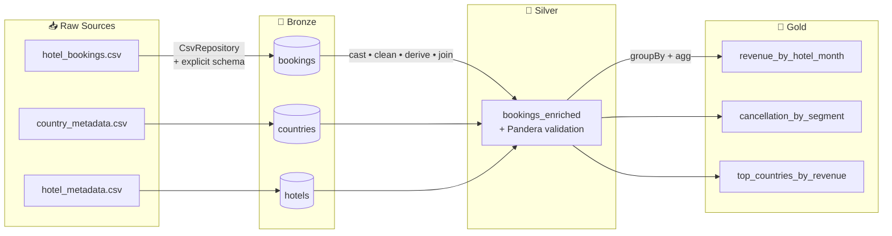
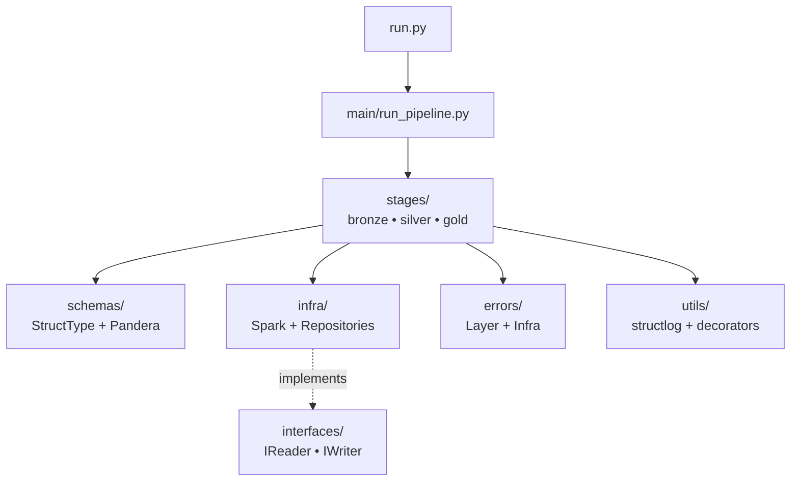
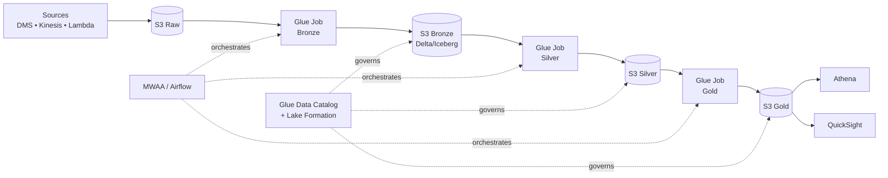

# 🏨 BeFly – Pipeline de Dados de Reservas Hoteleiras

Pipeline em **PySpark** seguindo a **arquitetura Medalhão** (Bronze → Silver → Gold) para análise de reservas hoteleiras da holding BeFly.

> Teste técnico para vaga de Engenheiro(a) de Dados Pleno/Sênior.
> **Autor:** Vitor Duarte — vitor02hugo@alu.ufc.br

---

## 🎯 Visão Geral

Este projeto implementa um pipeline ETL completo que:

1. **Bronze** – Ingere 3 CSVs (reservas + 2 tabelas de referência) e persiste como Parquet/Snappy preservando o schema original.
2. **Silver** – Limpa, tipifica, enriquece (joins) e valida o dataset com **Pandera**, criando colunas derivadas de negócio.
3. **Gold** – Produz 3 visões analíticas agregadas que respondem perguntas-chave do negócio.

A arquitetura segue **Clean Architecture** com camadas desacopladas (`infra/`, `stages/`, `schemas/`, `errors/`, `utils/`), facilitando testes, manutenção e migração futura para nuvem.

---

## 🗺 Arquitetura do Pipeline



### Camadas de Código (Clean Architecture)



### Visão Cloud (proposta de produção)



----

## 📁 Estrutura do Projeto

```
projeto-befly/
├── .vscode/
│   ├── launch.json              # configs de debug
│   └── tasks.json                # tasks executáveis
├── data/
│   ├── raw/                       # CSVs originais
│   ├── bronze/                  # parquet bruto
│   ├── silver/                   # parquet enriquecido + validado
│   └── gold/                      # visões analíticas
├── scripts/
│   └── download_raw.py    # baixa hotel_bookings.csv
├── src/
│   ├── run.py                     # entrypoint
│   ├── main/
│   │   ├── config.py            # pydantic-settings
│   │   └── run_pipeline.py  # orquestrador
│   ├── stages/
│   │   ├── bronze/{ingest_*.py, rules.py}
│   │   ├── silver/{build_bookings_enriched.py, rules.py}
│   │   └── gold/{revenue_by_hotel_month, cancellation_by_segment, top_countries_by_revenue, rules}.py
│   ├── schemas/
│   │   ├── bronze/             # StructTypes explícitos
│   │   └── silver/               # Pandera DataFrameSchema
│   ├── infra/
│   │   ├── spark/session_factory.py
│   │   ├── repositories/{csv,parquet}_repository.py
│   │   └── interfaces/{i_reader,i_writer}.py
│   ├── errors/
│   │   ├── infra_errors.py     # SparkSession, Storage R/W
│   │   └── layer_errors.py    # Bronze/Silver/Gold/Schema
│   └── utils/
│       ├── decorators.py     # @retry, @log_execution_time
│       └── logger.py             # structlog
├── requirements.txt
└── README.md
```

---

```markdown
## 🚀 Como Executar

### Pré-requisitos
- Python 3.12+, Java 11+ (PySpark precisa), Linux/macOS/WSL.

### Setup local
```bash
python3 -m venv .venv && source .venv/bin/activate
pip install -r requirements.txt
python scripts/download_raw.py   # baixa hotel_bookings.csv (~17MB)
```
> Os metadados (`country_metadata.csv`, `hotel_metadata.csv`) já estão em `data/raw/`.

### Rodar
```bash
PYTHONPATH=src python src/run.py       # terminal
# ou no VS Code: Ctrl+Shift+B (task default) / F5 (debug)
```

### Docker
```bash
docker compose run --rm download-raw   # primeira vez
docker compose up pipeline --build
```

### Testes
```bash
PYTHONPATH=src pytest tests/ -v
```
Cobrem as regras de negócio dos stages (bronze/silver/gold).

### Tasks do VS Code
`Run Full`, `Download Raw Data`, `Install Dependencies`, `Setup` (deps + raw), `Clean Data Layers`.

---

## 🧠 Decisões de Design

- **Dataset completo** (~119k linhas) — cabe tranquilo em laptop modesto.
- **Sem particionamento** — volume não justifica o overhead. Em produção (1GB+ dados), reavaliar.
- **Schemas explícitos** (StructType) na Bronze — sem `inferSchema`.
- **Pandera na Silver** — vai além de tipo: valida `adr >= 0`, `is_canceled in {0,1}`, mês 1–12, etc. Falha → `SchemaValidationError`.
- **Erros em 2 famílias**: `InfraError` (Spark/storage) e `LayerError` (regras de cada camada). Tratamento granular no orquestrador.
- **structlog** — logs JSON, prontos pra CloudWatch/Datadog.
- **Repositories** (`CsvRepository`, `ParquetRepository`) implementam `IReader/IWriter` (Protocol). Trocar local por S3 = trocar implementação, stages não mudam.
- **Decorators**: `@retry` (3x, 2s) e `@log_execution_time`.
- **Quality report** JSON gerado a cada run da Silver (contagens, nulos, filtros).

---

## 🔄 Silver — o que acontece

| Etapa | Função | O quê |
|---|---|---|
| Cast | `cast_columns` | 17 colunas pra int + `reservation_status_date` pra date |
| Nulos | `fill_nulls` | `children` → 0, `country` → "UNK" |
| Filtros | `filter_invalid_bookings` | sem hóspedes, `adr < 0` (loga removidos) |
| Datas | `add_arrival_date` | year + month_num + day → DateType |
| Derivadas | `add_derived_columns` | total_nights, total_guests, is_family, is_long_stay, revenue, booking_status |
| Joins | `enrich_with_countries`, `enrich_with_hotels` | LEFT joins |
| Validação | Pandera | 30+ checks |

---

## 📊 Visões Gold

| Visão | Granularidade | Responde |
|---|---|---|
| `revenue_by_hotel_month` | hotel × ano × mês | Quanto cada hotel fatura por mês? |
| `cancellation_by_segment` | segment × channel × customer_type | Quem cancela mais e com que antecedência? |
| `top_countries_by_revenue` | country (Top 20) | De onde vêm os hóspedes mais valiosos? |

---

## ☁️ Adaptação para AWS / Databricks

Em produção, `data/raw/` vira **S3** (`s3://befly-lake/raw/`), alimentado por DMS/Kinesis/Lambda conforme a fonte. Bronze/Silver/Gold seriam **Delta Lake** (Databricks) ou **Iceberg** (Glue 4+/Athena) para ter ACID, time travel, schema evolution e MERGE idempotente. Catálogo via **Glue Data Catalog** ou **Unity Catalog**, consumo via **Athena** e **QuickSight/Power BI/QLik Sense**. Como os repositories já usam Protocol, basta um `S3ParquetRepository` ou `DeltaRepository` — `stages/`, o codigo fica intocado :).

Orquestração com **Airflow (MWAA)** ou **Databricks Workflows** (cada stage = task, com retry/SLA/backfill). Qualidade evoluiria do Pandera para **Glue Data Quality** ou **Great Expectations**, com quarentena em `data/rejected/`. Governança via **Lake Formation** / Unity Catalog (acesso por linha/coluna), lineage via OpenLineage. CI/CD com GitHub Actions + Databricks Asset Bundles. Logs structlog já saem em JSON, então CloudWatch/Datadog consomem direto. Gold publicada em zona "consumption" otimizada (Z-order, particionada por ano/mês).

---

## 🛠 Stack

Python 3.12 · PySpark 3.5+ · pydantic-settings · pandera[pyspark] · structlog · Parquet+Snappy · pytest

---

## ✅ Requisitos

Todos os RF (B01–E03) e RNF do `system_requirements.md` atendidos. Bônus: schema explícito, structlog, validação Pandera, retry, Clean Architecture, Docker, CI, testes, quality report.
```